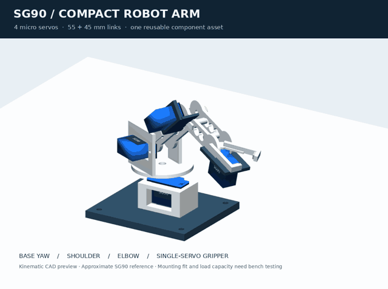

# SG90 four-servo robot arm

A compact CAD prototype using **four copies of the blue SG90-style 9 g servo**
shown in the issue request: base yaw, shoulder pitch, elbow pitch, and a gripper
with one fixed jaw and one servo-driven jaw. The arm has 55 mm and 45 mm links.



[STEP assembly (ZIP)](sg90-robot-arm.step.zip) · [Still preview](sg90-robot-arm.png) ·
[Build script](build.py) · [Library contract](../../docs/component-asset-library.md)

## What is verified

The assembly is real OCCT STEP geometry; the preview animates its joint hierarchy.
The original servo STEP and preview STL are registered once in Forma's existing
private artifact storage. Four independent placements reference that same asset
version. The renderer also reuses the stored servo STL instead of tessellating it
four times.

The script creates two canonical Forma projects. It closes the first process's
SQLite connections and runs a separate Python process for the second project.
That second process refuses to regenerate a servo if the library misses.

| Operation | First project | Second project / new process |
|---|---:|---:|
| Library source callback | 1 | 0 |
| Servo CAD generation | 1 | 0 |
| Servo preview conversion | 1 | 0 |
| Web search / source download | 0 / 0 | 0 / 0 |
| Stored representation writes | 2 | 0 |
| Pinned servo instances | 4 | 4 |

The JSON evidence files retain the exact asset ID, version, project and revision
IDs. This is the **generated-asset path** of #576. No vendor CAD was downloaded;
#530's external CAD sourcing specialist is still separate work.

## Servo identity and mechanical limits

The photo suggests a TowerPro SG90; it cannot establish the exact supplier,
revision, clone dimensions or positional-versus-continuous electronics. This
example deliberately uses `photo-reference-v1` and the explicit `positional`
variant, with `approximate: true`. A continuous-rotation servo cannot substitute
for these position-controlled joints.

[TowerPro's SG90 Analog page](https://towerpro.com.tw/product/sg90-analog/) lists
9 g, nominal 23 × 12.2 × 29 mm and 1.8 kgf·cm **stall** torque at 4.8 V. The
simplified model includes 32.3 mm overall mounting-tab width. The 28.2 mm mounting
hole spacing, hole diameters, spline, horn and small case details are assumptions;
measure your actual servos before fabricating the brackets. The original
manufacturer CAD was not available through this task's input.

The arm is **not yet a fabrication-approved or physically tested design**.
The exported bracket meshes are starting geometry for fitting. Fastener lengths,
horn attachment, pivot support/bearings, cable clearance, gripper contact and full
collision clearance need bench verification. The motion is kinematics, not motor
control or a physics/load simulation.

A **5 g payload is a design target**, not a demonstrated rating. A horizontal-arm
estimate using solid PLA volumes, two distal 9 g servos, 4 g of hardware and 5 g
at 135 mm gives approximately **0.37 kgf·cm** shoulder gravity torque. This excludes
friction, acceleration and wiring drag. A chosen design budget of one third of
published stall torque is 0.60 kgf·cm; that is an engineering assumption, not a
manufacturer continuous-torque rating. Verify the load and temperature on the
actual servo batch before raising the target.

## BOM and wiring plan

| Part | Quantity | In CAD / use |
|---|---:|---|
| SG90 positional micro servo | 4 | S1 base, S2 shoulder, S3 elbow, S4 gripper |
| Supplied servo horns and retaining screws | 4 sets | Reuse the servo's supplied spline interface; never print the spline |
| Printed base + yaw cradle + turntable | 1 each | Base support |
| Printed shoulder mount + idler post | 1 each | Shoulder support |
| Printed upper cheek | 2 | 55 mm joint spacing |
| Printed elbow cradle + bridge | 1 each | Carries S3 |
| Printed forearm cheek | 2 | 45 mm joint spacing |
| Printed gripper cradle + two jaws | 1 each | One moving jaw; one fixed |
| Rubber gripper pads | 2 | Replaceable contact faces |
| M2-class servo-tab hardware | 8 sets | Final diameter/length must match actual tabs and brackets |
| M3-class spacers/pivot hardware | As fitted | Four link spacers and supported idler pivots; select lengths after fit test |
| 5 V logic controller with four servo outputs | 1 | Off-model; e.g. an Arduino-compatible controller |
| Regulated servo supply, common ground, switch and wiring | 1 set | Off-model; size from measured peak current of the actual four servos |

Connect each servo's ground to the supply and controller common ground. Connect
servo power to the external regulated rail at the servo's verified operating
voltage, and one signal per controller output. Do not feed the servo bank from a
microcontroller's USB/regulator pin. Calibrate each servo near its midpoint
before installing horns; establish conservative travel limits before attaching
links. This package intentionally contains no untested motor-driving firmware.

## Rebuild

Use Python 3.12 with Forma's backend dependencies and CadQuery/PyVista/ImageIO.
A desktop graphics session or an offscreen-capable VTK setup is needed to render
on Linux; `--no-render` builds the STEP and persistence evidence without graphics.

```sh
python -m pip install -e ".[backend]" cadquery pyvista imageio
python examples/sg90-library-arm/build.py --output ./sg90-arm-output
```

Use a new empty output directory for fresh first-ingestion counts. Outputs include
STEP, a 96-frame GIF, still image, print-part STLs, provenance, both project
snapshots, and first/restart evidence. The local demo database/artifact directory
can be reused between runs; they are excluded from the downloadable design ZIP.

Source CAD in this example is MIT licensed under this repository's license. The
TowerPro name and published product data are attribution, not certification or a
claim that these are manufacturer-provided CAD files.
